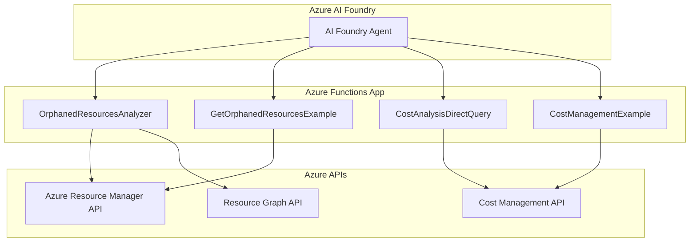

# Azure Cost Management & Orphaned Resources Analyzer

A comprehensive Azure Functions application that provides cost analysis and orphaned resource detection across Azure subscriptions. This application integrates with Azure AI Foundry agents to provide intelligent resource management and cost optimization recommendations.

## 🏗️ Architecture



## 🚀 Features

### 1. Orphaned Resources Detection
- **Virtual Machines**: Identifies VMs without Azure Hybrid Benefit (AHB) eligible for Windows Server, RHEL, and SLES
- **Network Interfaces**: Detects NICs not attached to any virtual machine
- **Public IP Addresses**: Finds unattached public IPs
- **Managed Disks**: Identifies disks not attached to any VM
- **Network Security Groups**: Detects NSGs not associated with subnets or NICs

### 2. Cost Analysis
- **Direct Cost Management API Integration**: Real-time cost data retrieval
- **Multi-Resource Cost Analysis**: Batch processing with rate limiting optimization
- **Flexible Date Ranges**: Auto-calculation or custom date periods
- **Granular Cost Breakdown**: Daily, monthly, or aggregate cost reporting
- **Rate Limiting Handling**: ClientType header implementation to prevent 429 errors

### 3. Azure AI Foundry Integration
- **Agent-Triggered Analysis**: Seamless integration with AI Foundry agents
- **Intelligent Recommendations**: AI-powered cost optimization suggestions
- **Automated Reporting**: Structured data output for agent consumption

## 📋 Azure Functions

### 1. OrphanedResourcesAnalyzer
**Endpoint**: `/api/orphaned-resources`  
**Method**: POST  
**Purpose**: Comprehensive orphaned resource detection and analysis

**Request Schema**:
```json
{
  "subscription_id": "string (required)",
  "resource_types": ["VirtualMachines", "NetworkInterfaces", "PublicIPAddresses", "Disks", "NetworkSecurityGroups"],
  "resource_group": "string (optional)",
  "include_costs": true,
  "cost_period_days": 30
}
```

### 2. GetOrphanedResourcesExample
**Endpoint**: `/api/orphaned-resources-example`  
**Method**: GET  
**Purpose**: Sample orphaned resources with mock data for testing

### 3. CostAnalysisDirectQuery
**Endpoint**: `/api/cost-analysis`  
**Method**: POST  
**Purpose**: Direct Azure Cost Management API queries with advanced filtering

**Request Schema**:
```json
{
  "subscription_id": "string (required)",
  "query_type": "specific_resources|resource_group|service|top_resources|subscription",
  "resource_ids": ["array of resource IDs"],
  "start_date": "YYYY-MM-DD",
  "end_date": "YYYY-MM-DD",
  "granularity": "Daily|Monthly",
  "top_n": 10
}
```

### 4. CostManagementExample
**Endpoint**: `/api/cost-example`  
**Method**: GET  
**Purpose**: Sample cost management data for testing and integration

## 🤖 Azure AI Foundry Agent Integration

This application is designed to be triggered by Azure AI Foundry agents for intelligent resource management and cost optimization.

### Agent Configuration

**Agent Schema** (to be customized):
```json
{
  "name": "AzureCostOptimizationAgent",
  "description": "Intelligent Azure resource cost analysis and optimization agent",
  "functions": [
    {
      "name": "analyze_orphaned_resources",
      "description": "Detect and analyze orphaned Azure resources",
      "parameters": {
        "subscription_id": {"type": "string", "required": true},
        "resource_types": {"type": "array", "items": {"type": "string"}},
        "include_costs": {"type": "boolean", "default": true}
      }
    },
    {
      "name": "analyze_resource_costs",
      "description": "Analyze costs for specific Azure resources",
      "parameters": {
        "subscription_id": {"type": "string", "required": true},
        "resource_ids": {"type": "array", "items": {"type": "string"}},
        "date_range_days": {"type": "integer", "default": 30}
      }
    }
  ]
}
```

### Integration Instructions

1. **Setup Agent Connection**:
   - Configure the agent to connect to your deployed Azure Functions endpoint
   - Set up authentication using Function Keys or Azure AD
   - Configure retry policies for rate limiting handling

2. **Function Endpoint URLs**:
   ```
   Base URL: https://your-function-app.azurewebsites.net/api/
   
   Orphaned Resources: POST /orphaned-resources
   Cost Analysis: POST /cost-analysis
   ```

3. **Authentication Headers**:
   ```
   x-functions-key: YOUR_FUNCTION_KEY
   Content-Type: application/json
   ```

4. **Rate Limiting Considerations**:
   - Functions implement ClientType headers to optimize Azure API rate limits
   - Progressive delays between resource queries (2s + 0.5s per resource)
   - Automatic retry logic with exponential backoff

### Sample Agent Requests

**Orphaned Resources Analysis**:
```json
{
  "subscription_id": "your-subscription-id",
  "resource_types": ["VirtualMachines", "NetworkInterfaces", "PublicIPAddresses"],
  "include_costs": true,
  "cost_period_days": 30
}
```

**Cost Analysis for Specific Resources**:
```json
{
  "subscription_id": "your-subscription-id",
  "resource_ids": [
    "/subscriptions/sub-id/resourceGroups/rg-name/providers/Microsoft.Compute/virtualMachines/vm-name",
    "/subscriptions/sub-id/resourceGroups/rg-name/providers/Microsoft.Network/publicIPAddresses/ip-name"
  ],
  "start_date": "2025-09-01",
  "end_date": "2025-10-01"
}
```

## 🛠️ Technical Implementation

### Core Technologies
- **Azure Functions v4**: Serverless compute platform
- **Python 3.7-3.12**: Runtime environment
- **Azure SDK for Python**: Azure service integration
- **Azure Cost Management API**: Real-time cost data
- **Azure Resource Graph**: Resource querying and filtering

### Key Features Implementation

#### Rate Limiting Optimization
- **ClientType Header**: `'ClientType': 'AwesomeType'` prevents 429 rate limiting errors
- **Progressive Delays**: 2s base + 0.5s per additional resource
- **Retry Logic**: Exponential backoff with maximum retry attempts
- **Individual Resource Queries**: More reliable than batch processing

#### Cost Analysis Accuracy
- **Direct API Integration**: Real-time cost data from Azure Cost Management
- **Date Range Handling**: Auto-calculation for "last 30 days" or custom ranges
- **2023→2025 Date Correction**: Handles agent date format inconsistencies
- **Resource-Specific Filtering**: Precise cost attribution per resource

#### Azure Hybrid Benefit Detection
- **OS-Specific Filtering**: Only Windows Server, RHEL, and SLES eligible
- **License Optimization**: Identifies VMs that could benefit from AHB
- **Cost Impact Analysis**: Calculates potential savings from AHB implementation

## 📁 Project Structure

```
├── function_app.py          # Main Azure Functions application
├── host.json               # Azure Functions host configuration
├── local.settings.json     # Local development settings
├── requirements.txt        # Python dependencies
├── README.md              # This documentation
└── tests/                 # Test files and debugging utilities
    ├── test_*.py          # Unit and integration tests
    ├── debug_*.py         # Debugging utilities
    └── *.md               # Additional documentation
```

## 🚀 Deployment

### Prerequisites
- Azure subscription
- Azure Functions Core Tools
- Python 3.7-3.12
- Azure CLI

### Local Development
```bash
# Install dependencies
pip install -r requirements.txt

# Start local Azure Functions runtime
func host start
```

### Azure Deployment
```bash
# Deploy to Azure Functions
func azure functionapp publish your-function-app-name
```

### Environment Variables
Configure in `local.settings.json` for local development or Application Settings for Azure:

```json
{
  "IsEncrypted": false,
  "Values": {
    "AzureWebJobsStorage": "DefaultEndpointsProtocol=https;AccountName=...",
    "FUNCTIONS_WORKER_RUNTIME": "python",
    "AZURE_CLIENT_ID": "your-client-id",
    "AZURE_CLIENT_SECRET": "your-client-secret",
    "AZURE_TENANT_ID": "your-tenant-id"
  }
}
```

## 🧪 Testing

The `tests/` directory contains comprehensive test suites:
- **Unit Tests**: Individual function testing
- **Integration Tests**: End-to-end Azure API testing
- **Performance Tests**: Rate limiting and optimization validation
- **Agent Simulation**: Azure AI Foundry agent interaction testing

## 🔧 Configuration

### Cost Analysis Settings
- **Default Date Range**: Last 30 days
- **Rate Limiting**: 2s + 0.5s progressive delays
- **Retry Attempts**: 3 attempts with exponential backoff
- **ClientType Header**: 'AwesomeType' for rate limit optimization

### Orphaned Resources Detection
- **Supported Resource Types**: VM, NIC, PublicIP, Disk, NSG
- **Azure Hybrid Benefit**: Windows Server, RHEL, SLES only
- **Cost Integration**: Optional cost analysis for detected resources

## 📊 Monitoring & Logging

- **Application Insights**: Integrated telemetry and performance monitoring
- **Function Logs**: Detailed execution logging for debugging
- **Rate Limiting Metrics**: Monitoring of API call patterns and 429 errors
- **Cost Analysis Accuracy**: Validation of returned cost data

## 🤝 Contributing

1. Fork the repository
2. Create a feature branch
3. Add tests for new functionality
4. Ensure all tests pass
5. Submit a pull request

## 📄 License

This project is licensed under the MIT License - see the LICENSE file for details.

## 🆘 Support

For support and questions:
- Review the test files in the `tests/` directory for examples
- Check Application Insights logs for debugging information
- Validate Azure permissions for Cost Management and Resource Graph APIs

---

**Note**: This application requires appropriate Azure permissions for Cost Management and Resource Graph APIs. Ensure your service principal or managed identity has the necessary roles assigned.