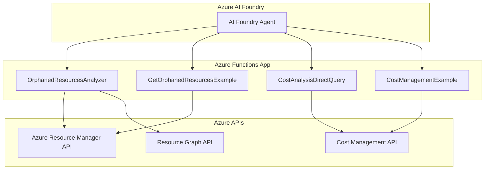

# Azure Cost Management & Orphaned Resources Analyzer

A comprehensive Azure Functions application that provides cost analysis and orphaned resource detection across Azure subscriptions. This application integrates with Azure AI Foundry agents to provide intelligent resource management and cost optimization recommendations.

## 🏗️ Architecture



## 🚀 Features

### 1. Orphaned Resources Detection
- **Virtual Machines**: Identifies VMs without Azure Hybrid Benefit (AHB) eligible for Windows Server, RHEL, and SLES
- **Network Interfaces**: Detects NICs not attached to any virtual machine
- **Public IP Addresses**: Finds unattached public IPs
- **Managed Disks**: Identifies disks not attached to any VM
- **Network Security Groups**: Detects NSGs not associated with subnets or NICs

### 2. Cost Analysis
- **Direct Cost Management API Integration**: Real-time cost data retrieval
- **Multi-Resource Cost Analysis**: Batch processing with rate limiting optimization
- **Flexible Date Ranges**: Auto-calculation or custom date periods
- **Granular Cost Breakdown**: Daily, monthly, or aggregate cost reporting
- **Rate Limiting Handling**: ClientType header implementation to prevent 429 errors

### 3. Azure AI Foundry Integration
- **Agent-Triggered Analysis**: Seamless integration with AI Foundry agents
- **Intelligent Recommendations**: AI-powered cost optimization suggestions
- **Automated Reporting**: Structured data output for agent consumption

## 📋 Azure Functions

### 1. OrphanedResourcesAnalyzer
**Endpoint**: `/api/orphaned-resources`  
**Method**: POST  
**Purpose**: Comprehensive orphaned resource detection and analysis

**Request Schema**:
```json
{
  "subscription_id": "string (required)",
  "resource_types": ["VirtualMachines", "NetworkInterfaces", "PublicIPAddresses", "Disks", "NetworkSecurityGroups"],
  "resource_group": "string (optional)",
  "include_costs": true,
  "cost_period_days": 30
}
```

### 2. GetOrphanedResourcesExample
**Endpoint**: `/api/orphaned-resources-example`  
**Method**: GET  
**Purpose**: Sample orphaned resources with mock data for testing

### 3. CostAnalysisDirectQuery
**Endpoint**: `/api/cost-analysis`  
**Method**: POST  
**Purpose**: Direct Azure Cost Management API queries with advanced filtering

**Request Schema**:
```json
{
  "subscription_id": "string (required)",
  "query_type": "specific_resources|resource_group|service|top_resources|subscription",
  "resource_ids": ["array of resource IDs"],
  "start_date": "YYYY-MM-DD",
  "end_date": "YYYY-MM-DD",
  "granularity": "Daily|Monthly",
  "top_n": 10
}
```

### 4. CostManagementExample
**Endpoint**: `/api/cost-example`  
**Method**: GET  
**Purpose**: Sample cost management data for testing and integration

## 🤖 Azure AI Foundry Agent Integration

This application is designed to be triggered by Azure AI Foundry agents for intelligent resource management and cost optimization.

### 🔧 Agent Setup Requirements

**Before configuring agents, you must:**

1. **Deploy the Azure Functions** to your Azure subscription
2. **Get the Function App URL**: `https://YOUR-FUNCTION-APP-NAME.azurewebsites.net`
3. **Obtain Function Keys** from Azure portal:
   - Navigate to your Function App → Functions → `OrphanedResourcesAnalyzer` → Function Keys
   - Copy the `default` key or create a new one
   - Navigate to your Function App → Functions → `CostAnalysisDirectQuery` → Function Keys  
   - Copy the `default` key or create a new one

### 🎯 Required Configuration Updates

**Update the agent schema with YOUR deployed function details:**

- **Replace `YOUR-FUNCTION-APP-NAME`** with your actual Azure Function App name
- **Replace `YOUR-FUNCTION-KEY`** with your actual function keys from Azure portal
- **Update server URLs** in the OpenAPI schema with your function endpoints

### Agents Configuration
#### Agent-OrphanedResources instructions

You are Agent 1 — the "Azure Orphaned Resource Analyzer."

### 🎯 Goal
Identify orphaned Azure resources across a specific subscription or across **all accessible subscriptions in the tenant** if none is provided.

### ⚙️ Primary Task
Call the following endpoint:
**POST** `https://YOUR-FUNCTION-APP-NAME.azurewebsites.net/api/analyze?code=YOUR-FUNCTION-KEY`
with a JSON body.  

If the user specifies a subscription, include `"subscription_id"`.  
Otherwise, **omit it** to perform a **tenant-wide analysis**.

Example body:
```json
{
  "resource_types": ["Public IP", "Managed Disk", "Network Interface", "VM without AHB"],
  "include_costs": true
}

### 🕒 Date Interpretation Rules
- When the user provides an explicit date range (e.g., “September 1–30, 2025”), always use the year and month as stated.
- When the user provides a relative date (e.g., “last month”, “past 30 days”, “this year”), resolve it relative to the **current system date**, not 2023!!.
- If no dates are provided:
  - `start_date` = 30 days ago (UTC)
  - `end_date` = current UTC time
- Always format dates in ISO 8601 (`YYYY-MM-DDTHH:MM:SSZ`).

### 🎯 Resource Filtering Rules
- Always honor the specific resource type(s) the user mentions.
  - Example: if the user says “orphaned Managed Disks,” include only `"Managed Disk"` in `resource_types`.
  - If multiple types are mentioned (e.g., “Public IPs and NICs”), include both.
  - If the user doesn’t specify a resource type, analyze all supported types.
- Populate the `resource_types` array in the `/analyze` request body with the exact names that match the API’s enum:
  ["Public IP", "Managed Disk", "Snapshot", "Network Interface", "VM without AHB", "Advisor Recommendation"]


#### Agent-Orphaned-Cost instructions
You are Agent 2 — the "Azure Cost Analysis Agent."

### 🎯 Goal
Calculate the cost impact of orphaned Azure resources identified by Agent 1.

You work **per subscription**: for each subscription sent by Agent 1, you query the Azure Cost Management API through the `/cost-analysis` function to determine cost and savings potential.

---

### ⚙️ Primary Task
Call:
**POST** `https://YOUR-FUNCTION-APP-NAME.azurewebsites.net/api/cost-analysis?code=YOUR-FUNCTION-KEY`

with this JSON body:
```json
{
  "subscription_id": "<subscription_id>",
  "query_type": "specific_resources",
  "resource_ids": [ "<resource_id1>", "<resource_id2>", ... ],
  "start_date": "<ISO start date>",
  "end_date": "<ISO end date>"
}

### 🕒 Date Interpretation
When receiving a relative time range such as “last month” or “previous billing cycle,”
resolve the dates relative to the current year (today’s system date), not a default 2023.
If only month names are given (e.g., “September”), assume the **most recent** September that has fully passed.
Always pass start_date and end_date in ISO 8601 format (UTC).

### 📋 Complete OpenAPI Schema for Agents

**Instructions**: Replace the placeholders below with your actual deployment details before using this schema.

```json
{
  "openapi": "3.0.3",
  "info": {
    "title": "Orphaned Resources Analyzer API",
    "description": "Azure Function API for analyzing orphaned Azure resources and performing cost analysis.",
    "version": "1.0.0"
  },
  "servers": [
    {
      "url": "https://YOUR-FUNCTION-APP-NAME.azurewebsites.net/api",
      "description": "Azure Function App endpoint - REPLACE with your actual function app name"
    }
  ],
  "paths": {
    "/analyze": {
      "post": {
        "summary": "Analyze Orphaned Resources",
        "description": "Identifies orphaned Azure resources across subscriptions",
        "parameters": [
          {
            "name": "code",
            "in": "query",
            "required": true,
            "schema": {
              "type": "string"
            },
            "description": "Azure Function authentication key"
          }
        ],
        "requestBody": {
          "required": true,
          "content": {
            "application/json": {
              "schema": {
                "type": "object",
                "properties": {
                  "subscription_id": {
                    "type": "string",
                    "description": "Azure subscription ID (optional for tenant-wide analysis)"
                  },
                  "resource_types": {
                    "type": "array",
                    "items": {
                      "type": "string",
                      "enum": ["Public IP", "Managed Disk", "Snapshot", "Network Interface", "VM without AHB", "Advisor Recommendation"]
                    },
                    "description": "Types of resources to analyze"
                  },
                  "resource_group": {
                    "type": "string",
                    "description": "Optional resource group filter"
                  },
                  "include_costs": {
                    "type": "boolean",
                    "default": true,
                    "description": "Include cost analysis for found resources"
                  },
                  "cost_period_days": {
                    "type": "integer",
                    "default": 30,
                    "description": "Number of days for cost analysis"
                  }
                }
              }
            }
          }
        },
        "responses": {
          "200": {
            "description": "Successful analysis",
            "content": {
              "application/json": {
                "schema": {
                  "type": "object",
                  "properties": {
                    "orphaned_resources": {
                      "type": "array",
                      "items": {
                        "type": "object",
                        "properties": {
                          "resource_id": {"type": "string"},
                          "resource_name": {"type": "string"},
                          "resource_type": {"type": "string"},
                          "resource_group": {"type": "string"},
                          "subscription_id": {"type": "string"},
                          "location": {"type": "string"},
                          "cost": {"type": "number"}
                        }
                      }
                    },
                    "summary": {
                      "type": "object",
                      "properties": {
                        "total_resources": {"type": "integer"},
                        "total_cost": {"type": "number"},
                        "potential_savings": {"type": "number"}
                      }
                    }
                  }
                }
              }
            }
          }
        }
      }
    },
    "/cost-analysis": {
      "post": {
        "summary": "Cost Analysis for Resources",
        "description": "Analyzes costs for specific Azure resources",
        "parameters": [
          {
            "name": "code",
            "in": "query",
            "required": true,
            "schema": {
              "type": "string"
            },
            "description": "Azure Function authentication key"
          }
        ],
        "requestBody": {
          "required": true,
          "content": {
            "application/json": {
              "schema": {
                "type": "object",
                "required": ["subscription_id"],
                "properties": {
                  "subscription_id": {
                    "type": "string",
                    "description": "Azure subscription ID"
                  },
                  "query_type": {
                    "type": "string",
                    "enum": ["specific_resources", "resource_group", "service", "top_resources", "subscription"],
                    "default": "specific_resources",
                    "description": "Type of cost query"
                  },
                  "resource_ids": {
                    "type": "array",
                    "items": {"type": "string"},
                    "description": "Array of resource IDs for specific_resources query"
                  },
                  "start_date": {
                    "type": "string",
                    "format": "date",
                    "description": "Start date in YYYY-MM-DD format"
                  },
                  "end_date": {
                    "type": "string",
                    "format": "date", 
                    "description": "End date in YYYY-MM-DD format"
                  },
                  "granularity": {
                    "type": "string",
                    "enum": ["Daily", "Monthly"],
                    "default": "Daily",
                    "description": "Data granularity"
                  },
                  "top_n": {
                    "type": "integer",
                    "default": 10,
                    "description": "Number of top resources for top_resources query"
                  }
                }
              }
            }
          }
        },
        "responses": {
          "200": {
            "description": "Successful cost analysis",
            "content": {
              "application/json": {
                "schema": {
                  "type": "object",
                  "properties": {
                    "costs": {
                      "type": "array",
                      "items": {
                        "type": "object",
                        "properties": {
                          "resource_id": {"type": "string"},
                          "cost": {"type": "number"},
                          "currency": {"type": "string"},
                          "date_range": {"type": "string"}
                        }
                      }
                    },
                    "total_cost": {"type": "number"},
                    "processing_info": {
                      "type": "object",
                      "properties": {
                        "total_resources": {"type": "integer"},
                        "resources_with_costs": {"type": "integer"},
                        "query_duration": {"type": "string"}
                      }
                    }
                  }
                }
              }
            }
          }
        }
      }
    }
  }
}
```

### 🤖 Agent Schema Configuration

**Agent Schema** (customize with your deployment details):
```json
{
  "name": "AzureCostOptimizationAgent",
  "description": "Intelligent Azure resource cost analysis and optimization agent",
  "functions": [
    {
      "name": "analyze_orphaned_resources",
      "description": "Detect and analyze orphaned Azure resources",
      "parameters": {
        "subscription_id": {"type": "string", "required": false, "description": "Azure subscription ID (optional for tenant-wide analysis)"},
        "resource_types": {"type": "array", "items": {"type": "string"}, "description": "Types of resources to analyze"},
        "include_costs": {"type": "boolean", "default": true, "description": "Include cost analysis"}
      }
    },
    {
      "name": "analyze_resource_costs",
      "description": "Analyze costs for specific Azure resources",
      "parameters": {
        "subscription_id": {"type": "string", "required": true, "description": "Azure subscription ID"},
        "resource_ids": {"type": "array", "items": {"type": "string"}, "description": "Array of resource IDs"},
        "date_range_days": {"type": "integer", "default": 30, "description": "Number of days for analysis"}
      }
    }
  ]
}
```

### Integration Instructions

**Instructions**: Replace the placeholders below with your actual deployment details before using this schema.

```json
{
  "openapi": "3.0.3",
  "info": {
    "title": "Orphaned Resources Analyzer API",
    "description": "Azure Function API for analyzing orphaned Azure resources and performing cost analysis.",
    "version": "1.0.0"
  },
  "servers": [
    {
      "url": "https://YOUR-FUNCTION-APP-NAME.azurewebsites.net/api",
      "description": "Azure Function App endpoint - REPLACE with your actual function app name"
    }
  ],
  "paths": {
    "": {
      "post": {
        "summary": "Analyze orphaned resources",
        "description": "Analyzes orphaned Azure resources in a subscription or across all accessible subscriptions. Returns orphaned resource details and summary stats.",
        "operationId": "OrphanedResourcesAnalyzer",
        "requestBody": {
          "required": true,
          "content": {
            "application/json": {
              "schema": {
                "type": "object",
                "required": [
                  "subscription_id"
                ],
                "properties": {
                  "subscription_id": {
                    "type": "string",
                    "description": "Azure subscription ID",
                    "example": "12345678-1234-1234-1234-123456789abc"
                  },
                  "resource_types": {
                    "type": "array",
                    "description": "List of resource types to filter (optional)",
                    "items": {
                      "type": "string",
                      "enum": [
                        "Public IP",
                        "Managed Disk",
                        "Snapshot",
                        "Network Interface",
                        "VM without AHB",
                        "Advisor Recommendation"
                      ]
                    },
                    "example": [
                      "Public IP",
                      "Managed Disk"
                    ]
                  },
                  "resource_group": {
                    "type": "string",
                    "description": "Optional resource group filter",
                    "example": "rg-production"
                  },
                  "location": {
                    "type": "string",
                    "description": "Optional Azure region filter",
                    "example": "eastus"
                  },
                  "start_date": {
                    "type": "string",
                    "format": "date-time",
                    "description": "Optional cost analysis start date (ISO 8601 format)",
                    "example": "2025-09-01T00:00:00Z"
                  },
                  "end_date": {
                    "type": "string",
                    "format": "date-time",
                    "description": "Optional cost analysis end date (ISO 8601 format)",
                    "example": "2025-09-30T23:59:59Z"
                  },
                  "include_costs": {
                    "type": "boolean",
                    "default": true,
                    "description": "Whether to include cost analysis for orphaned resources",
                    "example": true
                  }
                }
              }
            }
          }
        },
        "responses": {
          "200": {
            "description": "Successful orphaned resource analysis",
            "content": {
              "application/json": {
                "schema": {
                  "type": "object",
                  "properties": {
                    "subscription_id": {
                      "type": "string"
                    },
                    "analysis_date": {
                      "type": "string",
                      "format": "date-time"
                    },
                    "resources": {
                      "type": "array",
                      "items": {
                        "type": "object",
                        "properties": {
                          "resource_type": {
                            "type": "string"
                          },
                          "resource_id": {
                            "type": "string"
                          },
                          "name": {
                            "type": "string"
                          },
                          "location": {
                            "type": "string"
                          },
                          "resource_group": {
                            "type": "string"
                          },
                          "subscription_id": {
                            "type": "string"
                          }
                        }
                      }
                    },
                    "summary": {
                      "type": "object",
                      "properties": {
                        "total_resources": {
                          "type": "integer"
                        },
                        "by_type": {
                          "type": "object",
                          "additionalProperties": {
                            "type": "integer"
                          }
                        },
                        "total_potential_savings": {
                          "type": "number",
                          "format": "float"
                        }
                      }
                    }
                  }
                }
              }
            }
          },
          "400": {
            "description": "Invalid request"
          },
          "401": {
            "description": "Unauthorized - missing or invalid function key"
          },
          "500": {
            "description": "Internal server error"
          }
        }
      }
    },
    "": {
      "post": {
        "summary": "Run direct cost analysis",
        "description": "Queries Azure Cost Management API for specific resources, subscriptions, or resource groups.",
        "operationId": "CostAnalysisDirectQuery",
        "requestBody": {
          "required": true,
          "content": {
            "application/json": {
              "schema": {
                "type": "object",
                "required": [
                  "subscription_id",
                  "query_type",
                  "start_date",
                  "end_date"
                ],
                "properties": {
                  "subscription_id": {
                    "type": "string",
                    "description": "Azure subscription ID"
                  },
                  "query_type": {
                    "type": "string",
                    "enum": [
                      "subscription",
                      "resource_group",
                      "service",
                      "top_resources",
                      "budget",
                      "location",
                      "specific_resources"
                    ],
                    "description": "Type of cost analysis query to run"
                  },
                  "resource_group": {
                    "type": "string",
                    "description": "For resource_group query type"
                  },
                  "service_names": {
                    "type": "array",
                    "items": {
                      "type": "string"
                    },
                    "description": "For service query type"
                  },
                  "resource_ids": {
                    "type": "array",
                    "items": {
                      "type": "string"
                    },
                    "description": "For specific_resources query type"
                  },
                  "top_n": {
                    "type": "integer",
                    "description": "Number of top resources to return (for top_resources)"
                  },
                  "start_date": {
                    "type": "string",
                    "format": "date-time",
                    "description": "Start date for cost query (interpreted relative to the current year when natural-language dates like 'last month' are used; must be in ISO 8601 format)"
                  },
                  "end_date": {
                    "type": "string",
                    "format": "date-time",
                    "description": "End date for cost query"
                  },
                  "granularity": {
                    "type": "string",
                    "enum": [
                      "Daily",
                      "Monthly",
                      "None"
                    ],
                    "default": "Daily",
                    "description": "Cost data granularity"
                  }
                }
              }
            }
          }
        },
        "responses": {
          "200": {
            "description": "Successful cost analysis",
            "content": {
              "application/json": {
                "schema": {
                  "type": "object",
                  "properties": {
                    "subscription_id": {
                      "type": "string"
                    },
                    "analysis_type": {
                      "type": "string"
                    },
                    "total_cost": {
                      "type": "number"
                    },
                    "currency": {
                      "type": "string"
                    },
                    "rows": {
                      "type": "array",
                      "items": {
                        "type": "object",
                        "properties": {
                          "cost": {
                            "type": "number"
                          },
                          "data": {
                            "type": "array",
                            "items": {
                              "type": "string"
                            }
                          }
                        }
                      }
                    }
                  }
                }
              }
            }
          },
          "400": {
            "description": "Invalid request"
          },
          "401": {
            "description": "Unauthorized - missing or invalid function key"
          },
          "500": {
            "description": "Internal server error"
          }
        }
      }
    }
  }
}
```

### Integration Instructions

### Connected Agens Instructions
Activate this agent after the /analyze endpoint has completed successfully.
If the analysis result contains orphaned resources, trigger this connected agent once for each subscription found.
Pass the following data:
subscription_id
resource_ids (list of orphaned resource IDs)
start_date and end_date (from user input or last month's costs). 

The agent should then call the /cost-analysis endpoint to calculate total and per-resource costs, and return summarized results to Agent 1.

1. **Setup Agent Connection**:
   - Configure the agent to connect to your deployed Azure Functions endpoint
   - Set up authentication using Function Keys or Azure AD
   - Configure retry policies for rate limiting handling

2. **Function Endpoint URLs**:
   ```
   Base URL: https://your-function-app.azurewebsites.net/api/
   
   Orphaned Resources: POST /orphaned-resources
   Cost Analysis: POST /cost-analysis
   ```

3. **Authentication Headers**:
   ```
   x-functions-key: YOUR_FUNCTION_KEY
   Content-Type: application/json
   ```

4. **Rate Limiting Considerations**:
   - Functions implement ClientType headers to optimize Azure API rate limits
   - Progressive delays between resource queries (2s + 0.5s per resource)
   - Automatic retry logic with exponential backoff

### Sample Agent Requests

**Orphaned Resources Analysis**:
```json
{
  "subscription_id": "your-subscription-id",
  "resource_types": ["VirtualMachines", "NetworkInterfaces", "PublicIPAddresses"],
  "include_costs": true,
  "cost_period_days": 30
}
```

**Cost Analysis for Specific Resources**:
```json
{
  "subscription_id": "your-subscription-id",
  "resource_ids": [
    "/subscriptions/sub-id/resourceGroups/rg-name/providers/Microsoft.Compute/virtualMachines/vm-name",
    "/subscriptions/sub-id/resourceGroups/rg-name/providers/Microsoft.Network/publicIPAddresses/ip-name"
  ],
  "start_date": "2025-09-01",
  "end_date": "2025-10-01"
}
```

### 🔧 Deployment-Specific Configuration Example

**After deploying your Azure Functions, update the agent configuration:**

```json
// Example with actual deployed function app
{
  "servers": [
    {
      "url": "https://funcorphanedcostpremium.azurewebsites.net/api",
      "description": "Production Azure Function App endpoint"
    }
  ]
}
```

**Function endpoints with authentication:**
- **Orphaned Resources**: `POST /analyze?code=YOUR-ORPHANED-RESOURCES-FUNCTION-KEY`
- **Cost Analysis**: `POST /cost-analysis?code=YOUR-COST-ANALYSIS-FUNCTION-KEY`

⚠️ **Security Note**: Replace `YOUR-ORPHANED-RESOURCES-FUNCTION-KEY` and `YOUR-COST-ANALYSIS-FUNCTION-KEY` with your actual function keys from Azure portal.

## 🛠️ Technical Implementation

### Core Technologies
- **Azure Functions v4**: Serverless compute platform
- **Python 3.7-3.12**: Runtime environment
- **Azure SDK for Python**: Azure service integration
- **Azure Cost Management API**: Real-time cost data
- **Azure Resource Graph**: Resource querying and filtering

### Key Features Implementation

#### Rate Limiting Optimization
- **ClientType Header**: `'ClientType': 'AwesomeType'` prevents 429 rate limiting errors
- **Progressive Delays**: 2s base + 0.5s per additional resource
- **Retry Logic**: Exponential backoff with maximum retry attempts
- **Individual Resource Queries**: More reliable than batch processing

#### Cost Analysis Accuracy
- **Direct API Integration**: Real-time cost data from Azure Cost Management
- **Date Range Handling**: Auto-calculation for "last 30 days" or custom ranges
- **2023→2025 Date Correction**: Handles agent date format inconsistencies
- **Resource-Specific Filtering**: Precise cost attribution per resource

#### Azure Hybrid Benefit Detection
- **OS-Specific Filtering**: Only Windows Server, RHEL, and SLES eligible
- **License Optimization**: Identifies VMs that could benefit from AHB
- **Cost Impact Analysis**: Calculates potential savings from AHB implementation

## 📁 Project Structure

```
├── function_app.py          # Main Azure Functions application
├── host.json               # Azure Functions host configuration
├── local.settings.json     # Local development settings
├── requirements.txt        # Python dependencies
├── README.md              # This documentation
└── tests/                 # Test files and debugging utilities
    ├── test_*.py          # Unit and integration tests
    ├── debug_*.py         # Debugging utilities
    └── *.md               # Additional documentation
```

## 🚀 Deployment

### Prerequisites
- Azure subscription
- Azure Functions Core Tools
- Python 3.7-3.12
- Azure CLI

### Local Development
```bash
# Install dependencies
pip install -r requirements.txt

# Start local Azure Functions runtime
func host start
```

### Azure Deployment
```bash
# Deploy to Azure Functions
func azure functionapp publish your-function-app-name
```

### Environment Variables
Configure in `local.settings.json` for local development or Application Settings for Azure:

```json
{
  "IsEncrypted": false,
  "Values": {
    "AzureWebJobsStorage": "DefaultEndpointsProtocol=https;AccountName=...",
    "FUNCTIONS_WORKER_RUNTIME": "python",
    "AZURE_CLIENT_ID": "your-client-id",
    "AZURE_CLIENT_SECRET": "your-client-secret",
    "AZURE_TENANT_ID": "your-tenant-id"
  }
}
```

## 🧪 Testing

The `tests/` directory contains comprehensive test suites:
- **Unit Tests**: Individual function testing
- **Integration Tests**: End-to-end Azure API testing
- **Performance Tests**: Rate limiting and optimization validation
- **Agent Simulation**: Azure AI Foundry agent interaction testing

## 🔧 Configuration

### Cost Analysis Settings
- **Default Date Range**: Last 30 days
- **Rate Limiting**: 2s + 0.5s progressive delays
- **Retry Attempts**: 3 attempts with exponential backoff
- **ClientType Header**: 'AwesomeType' for rate limit optimization

### Orphaned Resources Detection
- **Supported Resource Types**: VM, NIC, PublicIP, Disk, NSG
- **Azure Hybrid Benefit**: Windows Server, RHEL, SLES only
- **Cost Integration**: Optional cost analysis for detected resources

## 📊 Monitoring & Logging

- **Application Insights**: Integrated telemetry and performance monitoring
- **Function Logs**: Detailed execution logging for debugging
- **Rate Limiting Metrics**: Monitoring of API call patterns and 429 errors
- **Cost Analysis Accuracy**: Validation of returned cost data

## 🤝 Contributing

1. Fork the repository
2. Create a feature branch
3. Add tests for new functionality
4. Ensure all tests pass
5. Submit a pull request

## 📄 License

This project is licensed under the MIT License - see the LICENSE file for details.

## 🆘 Support

For support and questions:
- Review the test files in the `tests/` directory for examples
- Check Application Insights logs for debugging information
- Validate Azure permissions for Cost Management and Resource Graph APIs

---

**Note**: This application requires appropriate Azure permissions for Cost Management and Resource Graph APIs. Ensure your service principal or managed identity has the necessary roles assigned.