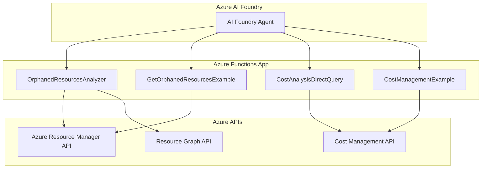

# Azure Cost Management & Orphaned Resources Analyzer

A comprehensive Azure Functions application that provides cost analysis and orphaned resource detection across Azure subscriptions. This application integrates with Azure AI Foundry agents to provide intelligent resource management and cost optimization recommendations.

## ⚠️ **IMPORTANT SECURITY DISCLAIMER**

> **🚨 CRITICAL NOTICE: This solution does NOT use private endpoints and communicates over public internet with Azure APIs.**
>
> **IMPLEMENTATION RESPONSIBILITY**: Any organization or individual implementing this solution must:
> - **Review the entire codebase** to ensure it meets their security requirements
> - **Validate that the solution aligns** with their organizational security policies  
> - **Assess network security implications** of public endpoint usage
> - **Implement additional security measures** as required by their environment
> - **Take full responsibility** for the security implications of deployment
>
> **Microsoft, the solution authors, and contributors assume NO RESPONSIBILITY for security breaches, data exposure, or policy violations that may result from implementing this solution. The implementation and security review responsibility lies entirely with the implementing party.**

## 🏗️ Infrastructure Requirements

### Azure Functions
- **Service Plan**: Premium EP1 (minimum 1 instance)
- **Operating System**: Linux
- **Runtime**: Python 3.11
- **Authentication**: Managed Identity (System-assigned recommended)

### Required Azure Permissions
The Azure Functions Managed Identity requires the following role assignments:

#### Storage Account Permissions
- **Storage Blob Data Owner** - On the Function App's Storage Account

#### Subscription/Tenant Level Permissions  
Assign these roles on the scope you want to analyze (subscription or management group):
- **Reader** - For resource enumeration and details
- **Cost Management Reader** - For accessing cost data and billing information
- **Advisor Recommendations Contributor** - For assessments and reviews access

### Azure AI Foundry Requirements
- **Azure AI Foundry Resource** - Foundry resource for AI orchestration
- **Azure AI Foundry Project** - Project workspace within the Foundry
- **Connection Configuration** - Proper endpoint and authentication setup between Foundry agents and Functions

### Network Requirements
> ⚠️ **Security Note**: This solution uses **public endpoints** for all Azure service communications. No private endpoint or VNET integration is configured.

### Python Dependencies
- **Python Runtime**: 3.11 (as specified in requirements.txt)
- **Azure SDK Libraries**: For Cost Management, Resource Graph, and ARM APIs
- **Function Runtime**: Azure Functions v4

## 🏗️ Architecture



## 🚀 Features

### Orphaned Resources Detection
- **Virtual Machines**: Identifies VMs without Azure Hybrid Benefit (AHB) eligible for Windows Server, RHEL, and SLES
- **Network Interfaces**: Detects NICs not attached to any virtual machine
- **Public IP Addresses**: Finds unattached public IPs
- **Managed Disks**: Identifies disks not attached to any VM
- **Network Security Groups**: Detects NSGs not associated with subnets or NICs

### Cost Analysis & Optimization
- **Direct Cost Management API Integration**: Real-time cost data retrieval
- **Multi-Resource Cost Analysis**: Batch processing with rate limiting optimization
- **Flexible Date Ranges**: Auto-calculation or custom date periods
- **Granular Cost Breakdown**: Daily, monthly, or aggregate cost reporting
- **Azure Hybrid Benefit Detection**: Identifies potential licensing cost savings

### Azure AI Foundry Integration
- **Agent-Triggered Analysis**: Seamless integration with AI Foundry agents
- **Intelligent Recommendations**: AI-powered cost optimization suggestions
- **Automated Reporting**: Structured data output for agent consumption

## 📋 Azure Functions API Reference

### 1. OrphanedResourcesAnalyzer
**Endpoint**: `/api/orphaned-resources`  
**Method**: POST  
**Purpose**: Comprehensive orphaned resource detection and analysis

**Request Schema**:
```json
{
  "subscription_id": "string (required)",
  "resource_types": ["VirtualMachines", "NetworkInterfaces", "PublicIPAddresses", "Disks", "NetworkSecurityGroups"],
  "resource_group": "string (optional)",
  "include_costs": true,
  "cost_period_days": 30
}
```

### 2. GetOrphanedResourcesExample
**Endpoint**: `/api/orphaned-resources-example`  
**Method**: GET  
**Purpose**: Sample orphaned resources with mock data for testing

### 3. CostAnalysisDirectQuery
**Endpoint**: `/api/cost-analysis`  
**Method**: POST  
**Purpose**: Direct Azure Cost Management API queries with advanced filtering

**Request Schema**:
```json
{
  "subscription_id": "string (required)",
  "query_type": "specific_resources|resource_group|service|top_resources|subscription",
  "resource_ids": ["array of resource IDs"],
  "start_date": "YYYY-MM-DD",
  "end_date": "YYYY-MM-DD",
  "granularity": "Daily|Monthly",
  "top_n": 10
}
```

### 4. CostManagementExample
**Endpoint**: `/api/cost-example`  
**Method**: GET  
**Purpose**: Sample cost management data for testing and integration

## 🤖 Azure AI Foundry Agent Integration

This application is designed to be triggered by Azure AI Foundry agents for intelligent resource management and cost optimization.

### Agent Configuration Files

All agent configurations, instructions, and schemas are located in the **`Agents/`** folder:

- **`Agent-OrphanedResources.txt`** - Instructions for the Orphaned Resources Analyzer agent
- **`Agent-Orphaned-Cost.txt`** - Instructions for the Cost Analysis agent  
- **`agents_schema.json`** - Complete OpenAPI schema for both agents
- **`connected-agents.txt`** - Connection and deployment instructions

### Agent Architecture

This application provides **two specialized agents** that work together:

1. **Agent 1: Orphaned Resources Analyzer** - Detects unused Azure resources
2. **Agent 2: Cost Analysis Agent** - Calculates financial impact of orphaned resources

**Detailed configurations and instructions for each agent are available in the `Agents/` folder.**

### Integration Benefits

- **Real-time Data**: Direct Azure API integration for accurate results
- **Cost Optimization**: Immediate identification of potential savings
- **Flexible Deployment**: Support for single subscription or tenant-wide analysis

### Quick Setup Guide

1. **Deploy your Azure Functions** to your Azure subscription
2. **Get your function keys** from Azure portal (Function App → Functions → Function Keys)
3. **Update the configuration files** in the `Agents/` folder with your deployment details:
   - Replace `YOUR-FUNCTION-APP-NAME` with your actual function app name
   - Replace `YOUR-FUNCTION-KEY` with your actual function keys
4. **Use the files in the `Agents/` folder** to configure your Azure AI Foundry agents

⚠️ **Security Note**: Never commit actual function keys to version control. Use placeholders in templates.

## 🛠️ Technical Implementation

### Core Technologies
- **Azure Functions v4**: Serverless compute platform
- **Python 3.7-3.12**: Runtime environment
- **Azure SDK for Python**: Azure service integration
- **Azure Cost Management API**: Real-time cost data
- **Azure Resource Graph**: Resource querying and filtering

### Key Features Implementation

#### Rate Limiting Optimization
- **ClientType Header**: `'ClientType': 'AwesomeType'` prevents 429 rate limiting errors
- **Progressive Delays**: 2s base + 0.5s per additional resource
- **Retry Logic**: Exponential backoff with maximum retry attempts
- **Individual Resource Queries**: More reliable than batch processing

#### Cost Analysis Accuracy
- **Direct API Integration**: Real-time cost data from Azure Cost Management
- **Date Range Handling**: Auto-calculation for "last 30 days" or custom ranges
- **Resource-Specific Filtering**: Precise cost attribution per resource
- **Date Format Standardization**: ISO 8601 format (UTC) for all date ranges

#### Azure Hybrid Benefit Detection
- **OS-Specific Filtering**: Only Windows Server, RHEL, and SLES eligible
- **License Optimization**: Identifies VMs that could benefit from AHB
- **Cost Impact Analysis**: Calculates potential savings from AHB implementation

### Date Handling Guidelines
When receiving a relative time range such as "last month" or "previous billing cycle":
- Resolve dates relative to the current year (today's system date), not a default 2023
- If only month names are given (e.g., "September"), assume the **most recent** September that has fully passed
- Always pass start_date and end_date in ISO 8601 format (UTC)

## 📁 Project Structure

```
├── function_app.py          # Main Azure Functions application
├── host.json               # Azure Functions host configuration
├── local.settings.json     # Local development settings
├── requirements.txt        # Python dependencies
├── README.md              # This documentation
├── Agents/                # Azure AI Foundry agent configurations
│   ├── Agent-OrphanedResources.txt     # Orphaned Resources agent instructions
│   ├── Agent-Orphaned-Cost.txt         # Cost Analysis agent instructions
│   ├── agents_schema.json              # Complete OpenAPI schema
│   └── connected-agents.txt            # Connection and deployment guide
└── tests/                 # Test files and debugging utilities (excluded from git)
    ├── test_*.py          # Unit and integration tests
    ├── debug_*.py         # Debugging utilities
    └── *.md               # Additional documentation
```

## 🚀 Deployment

### Prerequisites
- **Azure Subscription** with appropriate billing permissions
- **Azure Functions Core Tools v4**
- **Python 3.11** (required version)
- **Azure CLI** with permissions to create resources
- **Azure AI Foundry** access for agent configuration

### Step 1: Create Azure Function App
```bash
# Create resource group
az group create --name rg-cost-analyzer --location eastus2

# Create storage account for Function App
az storage account create \
  --name sacostanalyzer$(date +%s) \
  --resource-group rg-cost-analyzer \
  --location eastus2 \
  --sku Standard_LRS

# Create Function App with Premium EP1 plan on Linux
az functionapp plan create \
  --resource-group rg-cost-analyzer \
  --name plan-cost-analyzer \
  --location eastus2 \
  --number-of-workers 1 \
  --sku EP1 \
  --is-linux

az functionapp create \
  --resource-group rg-cost-analyzer \
  --plan plan-cost-analyzer \
  --name func-cost-analyzer-$(date +%s) \
  --storage-account sacostanalyzer \
  --runtime python \
  --runtime-version 3.11 \
  --os-type Linux \
  --assign-identity
```

### Step 2: Configure Managed Identity Permissions
```bash
# Get the Function App's Managed Identity Object ID
FUNCTION_PRINCIPAL_ID=$(az functionapp identity show \
  --name your-function-app-name \
  --resource-group rg-cost-analyzer \
  --query principalId -o tsv)

# Assign Storage Blob Data Owner on Function's Storage Account
az role assignment create \
  --assignee $FUNCTION_PRINCIPAL_ID \
  --role "Storage Blob Data Owner" \
  --scope "/subscriptions/YOUR_SUBSCRIPTION_ID/resourceGroups/rg-cost-analyzer/providers/Microsoft.Storage/storageAccounts/YOUR_STORAGE_ACCOUNT"

# Assign Reader role (replace with your target scope)
az role assignment create \
  --assignee $FUNCTION_PRINCIPAL_ID \
  --role "Reader" \
  --scope "/subscriptions/YOUR_TARGET_SUBSCRIPTION_ID"

# Assign Cost Management Reader role
az role assignment create \
  --assignee $FUNCTION_PRINCIPAL_ID \
  --role "Cost Management Reader" \
  --scope "/subscriptions/YOUR_TARGET_SUBSCRIPTION_ID"

# Assign Advisor Recommendations Contributor role
az role assignment create \
  --assignee $FUNCTION_PRINCIPAL_ID \
  --role "Advisor Recommendations Contributor" \
  --scope "/subscriptions/YOUR_TARGET_SUBSCRIPTION_ID"
```

### Step 3: Set Up Azure AI Foundry
1. **Create Azure AI Foundry Hub**:
   - Navigate to Azure portal → Create Resource → Azure AI Foundry
   - Create a new Hub resource in your subscription

2. **Create Azure AI Foundry Project**:
   - In the Foundry Hub, create a new Project
   - Configure project settings and compute resources

3. **Configure Agent Connections**:
   - Use the configuration files in the `Agents/` folder
   - Update endpoints with your deployed Function App URL
   - Configure authentication using Function Keys

### Step 4: Local Development
```bash
# Install dependencies
pip install -r requirements.txt

# Start local Azure Functions runtime
func host start
```

### Step 5: Deploy to Azure
```bash
# Deploy to Azure Functions
func azure functionapp publish your-function-app-name --python
```

### Step 6: Configure Application Settings
```bash
# Set any required application settings
az functionapp config appsettings set \
  --name your-function-app-name \
  --resource-group rg-cost-analyzer \
  --settings "ENVIRONMENT=production"
```

## 🔧 Configuration

### ⚠️ Security Configuration Review Required
> **Before deploying to production, organizations must:**
> - Review all code for compliance with security policies
> - Assess the implications of public endpoint usage
> - Implement additional security controls as needed
> - Ensure proper network segmentation and access controls

### Required Azure Permissions (Managed Identity)
The Function App's **System-assigned Managed Identity** requires these specific roles:

#### Function App Storage Access
- **Storage Blob Data Owner** - Required on the Function App's own storage account

#### Target Subscription/Scope Permissions
Assign on the subscription(s) or management group you want to analyze:
- **Reader** - For enumerating and accessing resource details
- **Cost Management Reader** - For accessing billing and cost data  
- **Advisor Recommendations Contributor** - For assessments and reviews access

### Infrastructure Configuration
- **Function Plan**: Premium EP1 minimum (for consistent performance)
- **Operating System**: Linux (required for Python 3.11 runtime)
- **Python Version**: 3.11 (specified in function configuration)
- **Network Access**: Public endpoints (no private endpoint integration)

### Cost Analysis Settings
- **Default Date Range**: Last 30 days
- **Rate Limiting**: 2s + 0.5s progressive delays
- **Retry Attempts**: 3 attempts with exponential backoff
- **ClientType Header**: 'AwesomeType' for rate limit optimization

### Orphaned Resources Detection
- **Supported Resource Types**: VM, NIC, PublicIP, Disk, NSG
- **Azure Hybrid Benefit**: Windows Server, RHEL, SLES only
- **Cost Integration**: Optional cost analysis for detected resources

### Azure AI Foundry Configuration
- **Foundry Hub**: Required for agent orchestration
- **Foundry Project**: Workspace for managing agents and connections
- **Agent Connections**: Configure using files in `Agents/` folder
- **Authentication**: Function Keys for API access

### Network Security Considerations
> ⚠️ **Important**: This solution communicates over public internet:
> - All Azure API calls use public endpoints
> - No VNET integration or private endpoints configured
> - Implement additional network security as per your organization's requirements

## 📖 Additional Resources

- **Azure Functions Documentation**: [docs.microsoft.com/azure/azure-functions](https://docs.microsoft.com/azure/azure-functions)
- **Azure Cost Management API**: [docs.microsoft.com/rest/api/cost-management](https://docs.microsoft.com/rest/api/cost-management)
- **Azure AI Foundry**: [docs.microsoft.com/azure/ai-foundry](https://docs.microsoft.com/azure/ai-foundry)