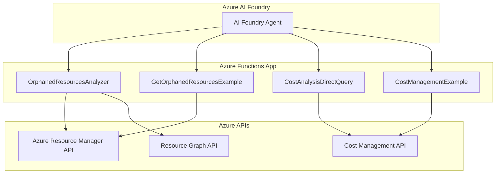

# Azure Cost Management & Orphaned Resources Analyzer

A comprehensive Azure Functions application that provides cost analysis and orphaned resource detection across Azure subscriptions. This application integrates with Azure AI Foundry agents to provide intelligent resource management and cost optimization recommendations.

## 🏗️ Architecture



## 🚀 Features

### Orphaned Resources Detection
- **Virtual Machines**: Identifies VMs without Azure Hybrid Benefit (AHB) eligible for Windows Server, RHEL, and SLES
- **Network Interfaces**: Detects NICs not attached to any virtual machine
- **Public IP Addresses**: Finds unattached public IPs
- **Managed Disks**: Identifies disks not attached to any VM
- **Network Security Groups**: Detects NSGs not associated with subnets or NICs

### Cost Analysis & Optimization
- **Direct Cost Management API Integration**: Real-time cost data retrieval
- **Multi-Resource Cost Analysis**: Batch processing with rate limiting optimization
- **Flexible Date Ranges**: Auto-calculation or custom date periods
- **Granular Cost Breakdown**: Daily, monthly, or aggregate cost reporting
- **Azure Hybrid Benefit Detection**: Identifies potential licensing cost savings

### Azure AI Foundry Integration
- **Agent-Triggered Analysis**: Seamless integration with AI Foundry agents
- **Intelligent Recommendations**: AI-powered cost optimization suggestions
- **Automated Reporting**: Structured data output for agent consumption

## 📋 Azure Functions

### 1. OrphanedResourcesAnalyzer
**Endpoint**: `/api/orphaned-resources`  
**Method**: POST  
**Purpose**: Comprehensive orphaned resource detection and analysis

**Request Schema**:
```json
{
  "subscription_id": "string (required)",
  "resource_types": ["VirtualMachines", "NetworkInterfaces", "PublicIPAddresses", "Disks", "NetworkSecurityGroups"],
  "resource_group": "string (optional)",
  "include_costs": true,
  "cost_period_days": 30
}
```

### 2. GetOrphanedResourcesExample
**Endpoint**: `/api/orphaned-resources-example`  
**Method**: GET  
**Purpose**: Sample orphaned resources with mock data for testing

### 3. CostAnalysisDirectQuery
**Endpoint**: `/api/cost-analysis`  
**Method**: POST  
**Purpose**: Direct Azure Cost Management API queries with advanced filtering

**Request Schema**:
```json
{
  "subscription_id": "string (required)",
  "query_type": "specific_resources|resource_group|service|top_resources|subscription",
  "resource_ids": ["array of resource IDs"],
  "start_date": "YYYY-MM-DD",
  "end_date": "YYYY-MM-DD",
  "granularity": "Daily|Monthly",
  "top_n": 10
}
```

### 4. CostManagementExample
**Endpoint**: `/api/cost-example`  
**Method**: GET  
**Purpose**: Sample cost management data for testing and integration

## 🤖 Azure AI Foundry Agent Integration

This application is designed to be triggered by Azure AI Foundry agents for intelligent resource management and cost optimization.

### Agent Configuration Files

All agent configurations, instructions, and schemas are located in the **`Agents/`** folder:

- **`Agent-OrphanedResources.txt`** - Instructions for the Orphaned Resources Analyzer agent
- **`Agent-Orphaned-Cost.txt`** - Instructions for the Cost Analysis agent  
- **`agents_schema.json`** - Complete OpenAPI schema for both agents
- **`connected-agents.txt`** - Connection and deployment instructions

### Quick Setup Guide

1. **Deploy your Azure Functions** to your Azure subscription
2. **Get your function keys** from Azure portal (Function App → Functions → Function Keys)
3. **Update the configuration files** in the `Agents/` folder with your deployment details:
   - Replace `YOUR-FUNCTION-APP-NAME` with your actual function app name
   - Replace `YOUR-FUNCTION-KEY` with your actual function keys
4. **Use the files in the `Agents/` folder** to configure your Azure AI Foundry agents

### Agent Architecture

This application provides **two specialized agents** that work together:

1. **Agent 1: Orphaned Resources Analyzer** - Detects unused Azure resources
2. **Agent 2: Cost Analysis Agent** - Calculates financial impact of orphaned resources

**Detailed configurations and instructions for each agent are available in the `Agents/` folder.**

### Integration Benefits

- **Seamless Workflow**: Agents can work independently or in sequence
- **Real-time Data**: Direct Azure API integration for accurate results
- **Cost Optimization**: Immediate identification of potential savings
- **Flexible Deployment**: Support for single subscription or tenant-wide analysis

## 🛠️ Technical Implementation

### Core Technologies
When receiving a relative time range such as “last month” or “previous billing cycle,”
resolve the dates relative to the current year (today’s system date), not a default 2023.
If only month names are given (e.g., “September”), assume the **most recent** September that has fully passed.
Always pass start_date and end_date in ISO 8601 format (UTC).

## 🧠 Agent Integration

All Azure AI Foundry agent configurations, OpenAPI schemas, and integration instructions are available in the `Agents/` folder.


1. **Setup Agent Connection**:
   - Configure the agent to connect to your deployed Azure Functions endpoint
   - Set up authentication using Function Keys or Azure AD
   - Configure retry policies for rate limiting handling

2. **Function Endpoint URLs**:
   ```
   Base URL: https://your-function-app.azurewebsites.net/api/
   
   Orphaned Resources: POST /orphaned-resources
   Cost Analysis: POST /cost-analysis
   ```

3. **Authentication Headers**:
   ```
   x-functions-key: YOUR_FUNCTION_KEY
   Content-Type: application/json
   ```

4. **Rate Limiting Considerations**:
   - Functions implement ClientType headers to optimize Azure API rate limits
   - Progressive delays between resource queries (2s + 0.5s per resource)
   - Automatic retry logic with exponential backoff

### 🔧 Deployment-Specific Configuration Example

**After deploying your Azure Functions, update the agent configuration:**

```json
// Example with actual deployed function app
{
  "servers": [
    {
      "url": "https://funcorphanedcostpremium.azurewebsites.net/api",
      "description": "Production Azure Function App endpoint"
    }
  ]
}
```

**Function endpoints with authentication:**
- **Orphaned Resources**: `POST /analyze?code=YOUR-ORPHANED-RESOURCES-FUNCTION-KEY`
- **Cost Analysis**: `POST /cost-analysis?code=YOUR-COST-ANALYSIS-FUNCTION-KEY`

⚠️ **Security Note**: Replace `YOUR-ORPHANED-RESOURCES-FUNCTION-KEY` and `YOUR-COST-ANALYSIS-FUNCTION-KEY` with your actual function keys from Azure portal.

## 🛠️ Technical Implementation

### Core Technologies
- **Azure Functions v4**: Serverless compute platform
- **Python 3.7-3.12**: Runtime environment
- **Azure SDK for Python**: Azure service integration
- **Azure Cost Management API**: Real-time cost data
- **Azure Resource Graph**: Resource querying and filtering

### Key Features Implementation

#### Rate Limiting Optimization
- **ClientType Header**: `'ClientType': 'AwesomeType'` prevents 429 rate limiting errors
- **Progressive Delays**: 2s base + 0.5s per additional resource
- **Retry Logic**: Exponential backoff with maximum retry attempts
- **Individual Resource Queries**: More reliable than batch processing

#### Cost Analysis Accuracy
- **Direct API Integration**: Real-time cost data from Azure Cost Management
- **Date Range Handling**: Auto-calculation for "last 30 days" or custom ranges
- **2023→2025 Date Correction**: Handles agent date format inconsistencies
- **Resource-Specific Filtering**: Precise cost attribution per resource

#### Azure Hybrid Benefit Detection
- **OS-Specific Filtering**: Only Windows Server, RHEL, and SLES eligible
- **License Optimization**: Identifies VMs that could benefit from AHB
- **Cost Impact Analysis**: Calculates potential savings from AHB implementation

## 📁 Project Structure

```
├── function_app.py          # Main Azure Functions application
├── host.json               # Azure Functions host configuration
├── local.settings.json     # Local development settings
├── requirements.txt        # Python dependencies
├── README.md              # This documentation
├── Agents/                # Azure AI Foundry agent configurations
│   ├── Agent-OrphanedResources.txt     # Orphaned Resources agent instructions
│   ├── Agent-Orphaned-Cost.txt         # Cost Analysis agent instructions
│   ├── agents_schema.json              # Complete OpenAPI schema
│   └── connected-agents.txt            # Connection and deployment guide
└── tests/                 # Test files and debugging utilities (excluded from git)
    ├── test_*.py          # Unit and integration tests
    ├── debug_*.py         # Debugging utilities
    └── *.md               # Additional documentation
```

## 🚀 Deployment

### Prerequisites
- Azure subscription
- Azure Functions Core Tools
- Python 3.7-3.12
- Azure CLI

### Local Development
```bash
# Install dependencies
pip install -r requirements.txt

# Start local Azure Functions runtime
func host start
```

### Azure Deployment
```bash
# Deploy to Azure Functions
func azure functionapp publish your-function-app-name
```

## 🔧 Configuration

### Cost Analysis Settings
- **Default Date Range**: Last 30 days
- **Rate Limiting**: 2s + 0.5s progressive delays
- **Retry Attempts**: 3 attempts with exponential backoff
- **ClientType Header**: 'AwesomeType' for rate limit optimization

### Orphaned Resources Detection
- **Supported Resource Types**: VM, NIC, PublicIP, Disk, NSG
- **Azure Hybrid Benefit**: Windows Server, RHEL, SLES only
- **Cost Integration**: Optional cost analysis for detected resources

**Note**: This application requires appropriate Azure permissions for Cost Management and Resource Graph APIs. Ensure your service principal or managed identity has the necessary roles assigned.