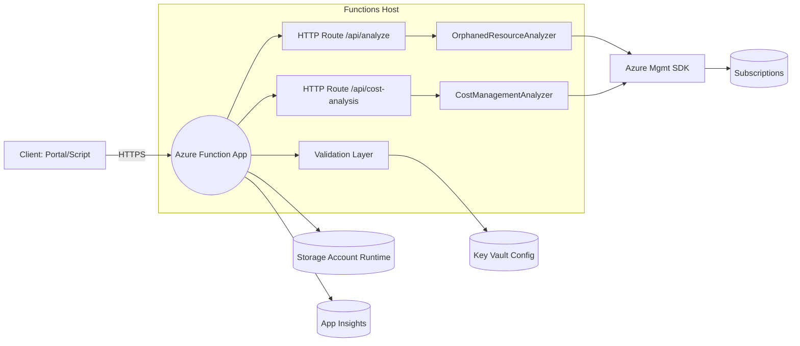

## Solution Architecture: Azure Cost & Orphaned Resources Analyzer

### 1. Purpose & Scope
This architecture describes the end-to-end design of the Azure Functions–based solution that analyzes orphaned Azure resources and cost drivers across subscriptions. It incorporates current implementation details (`function_app.py`) and recommended hardening & extensibility improvements.

### 2. High-Level Goals
- Discover and summarize orphaned cost-incurring resources (Public IPs, Disks, Snapshots, NICs, under-optimized VMs).
- Provide cost aggregation and filtering (subscription, resource group, service, resource-level breakdown, top spenders, location-based costs).
- Expose actionable summaries via HTTP endpoints for integration with dashboards, automation, or FinOps workflows.
- Operate using Managed Identity with least-privilege access across multiple subscriptions.
- Provide a foundation for future scheduling, event-driven automation, and AI-driven optimization suggestions.

### 3. Layered Architecture Overview
```
+--------------------------+            +------------------------------+
|      External Clients    |            |   (Future) Event Producers   |
|  - Portal / Dashboard    |            |   - Timer Trigger            |
|  - CI/CD / Pipelines     |            |   - Alerts (Cost Threshold)  |
|  - CLI / Scripts         |            +---------------+--------------+
|  - FinOps tooling        |                            |
+-------------+------------+                            v
              |                          +------------------------------+
              v                          |    Azure Functions Host      |
   HTTPS (Auth: Keys/MSAL)               |  (Python, function_app.py)   |
                                          |------------------------------|
                                          |  HTTP Routes:                |
                                          |   /api/analyze               |
                                          |   /api/cost-analysis         |
                                          |   /api/example (to harden)   |
                                          |   /api/cost-example (harden) |
                                          |------------------------------|
                                          |  Service Layer:              |
                                          |   OrphanedResourceAnalyzer   |
                                          |   CostManagementAnalyzer     |
                                          |   Retry / Backoff Decorator  |
                                          |------------------------------|
                                          |  Shared Utilities / Models   |
                                          +---------------+--------------+
                                                          |
                                                          v
                                   +-----------------------------------+
                                   | Azure SDK Management Plane APIs   |
                                   | (Compute, Network, CostMgmt,      |
                                   |  Advisor, Resources, Subscriptions)|
                                   +----------------+------------------+
                                                    |
                                                    v
                                      +-------------------------------+
                                      |   Azure Subscription Fabric    |
                                      |  (Resource Graph optional)     |
                                      +---------------+---------------+
                                                      |
                                                      v
                                      +-------------------------------+
                                      | Storage Account (Host runtime) |
                                      | Queue / Blob (future caching)  |
                                      +-------------------------------+
```

### 4. Component Breakdown
| Component | Responsibility | Notes |
|-----------|----------------|-------|
| HTTP Endpoints | Ingress; expose analysis & cost queries | Should require function key or AAD auth; remove anonymous |
| OrphanedResourceAnalyzer | Enumerates subscriptions, collects orphaned assets, builds summary | Add batching & paging for large tenants |
| CostManagementAnalyzer | Queries Cost Management API, aggregates results by dimension | Introduce caching for repetitive queries |
| Retry Decorator | Resilience for transient Azure API failures | Consider jitter & configurable max attempts |
| Managed Identity | Auth to Azure APIs | Replace broad roles with custom least-privilege role |
| Storage Account | Functions runtime state; potential durable entities | Enable soft delete, logging, restricted network access |
| (Future) Timer Trigger | Scheduled periodic scans | Drives continuous hygiene without manual calls |
| (Future) Durable Functions / Orchestrations | Parallelize subscription scanning | Useful for scaling to 100s+ subscriptions |
| (Future) App Insights | Telemetry, performance, anomaly detection | Correlate cost spikes with orphaned assets |
| (Future) Key Vault | Central secrets & configuration (budgets, thresholds) | Reference via managed identity |

### 5. Identity & Access Model (Current vs Target)
Current: Subscription-level assignments (Reader, Cost Management Reader, Advisor Recommendations Contributor). Broad scope.
Target Improvements:
- Custom Role: Read resource metadata, read cost management data, read advisor recommendations. Exclude write permissions.
- Scope: Narrow to required subscriptions or a management group. 
- Add: (Optional) Resource Graph read permissions if integrated.
- Conditional Access: Enforce AAD auth for non-automated callers; disable anonymous endpoints.

### 6. Data Flows
1. Client calls `/api/analyze` (with function key or AAD token).
2. Function initializes analyzers; enumerates accessible subscriptions using Managed Identity.
3. For each subscription, creates service-specific SDK clients and queries orphaned resource sets.
4. Builds per-subscription and global summaries; returns JSON response.
5. Cost queries follow similar pattern: dimension-based queries to Cost Management API, results normalized and aggregated.
6. Future: Results optionally persisted (Blob / Table) for historical trend analysis and ML features.

### 7. Security Architecture
Controls (Implemented): Secret scanning pre-commit; Managed Identity usage.
Gaps (Previously Identified): Anonymous endpoints; lack of input validation; excessive RBAC scope.
Hardening Additions:
- Input Validation Layer (Pydantic or custom schema) on query params & JSON bodies.
- Remove ANONYMOUS auth; use `FUNCTION` or AAD (`authLevel = FUNCTION` plus Azure AD front-door if required).
- Rate Limiting (Functions proxies / APIM) to protect cost endpoints.
- App Settings Hygiene: Move cost thresholds & optional sensitive config into Key Vault references.
- Storage: Disable shared key access, enforce HTTPS, firewall with allow-listed VNets if needed.
- Logging: Structured logs with PI/secret scrubbing; no raw request body dumps.

### 8. Observability & Operations
Recommended additions:
- Application Insights: Custom events (subscription_scan_started, resource_orphaned_detected, cost_query_latency_ms).
- Metrics: Count of orphaned resources by type; cost variance (% change vs prior period).
- Alerts: Cost threshold breach; high orphaned count; repeated API throttling.
- Trace Correlation: Add operation and subscription IDs in log context for multi-subscription debugging.

### 9. Scalability & Performance
- Parallelization: Use Durable Functions fan-out/fan-in for N subscriptions.
- Caching: Short-lived in-memory or Redis (future) for cost queries within same hour.
- Batching: Query resources in pages; avoid loading all NICs/Disks into memory at once.
- Backoff: Add jitter to reduce synchronized retry storms.
- Cold Start Mitigation: Premium plan or pre-warmed instances for predictable latency.

### 10. Extensibility Roadmap
| Phase | Enhancement | Outcome |
|-------|-------------|---------|
| Short | Input validation & remove anonymous endpoints | Immediate security posture boost |
| Short | Custom RBAC role & Key Vault integration | Least privilege & config security |
| Medium | Timer trigger + Durable orchestration | Automated continuous hygiene |
| Medium | Historical persistence for trend analytics | Enables anomaly & ML insight generation |
| Long | AI-based recommendation scoring (Advisor + heuristics) | Prioritized remediation guidance |
| Long | Multi-tenant SaaS front-end / APIM gateway | Managed service version |

### 11. Reference Architecture Checklist
- [ ] Enforce authenticated access (AAD or function keys) on all endpoints
- [ ] Implement input validation layer (schemas)
- [ ] Define & assign custom least-privilege role
- [ ] Add Application Insights & structured logging
- [ ] Integrate Key Vault for sensitive or configurable parameters
- [ ] Introduce timer trigger for scheduled scans
- [ ] Add durable orchestration for scaling subscriptions
- [ ] Implement caching layer for repetitive cost queries
- [ ] Restrict Storage Account network & disable shared key access
- [ ] Implement metrics & alerts (orphaned count, cost anomalies)

### 12. Mermaid Diagram (Optional View)


### 13. Edge Cases & Considerations
- Large Tenant: 1000+ subscriptions → need concurrency & rate control.
- Throttling: Cost Management API rate limits → implement adaptive backoff & partial result handling.
- Partial Permissions: Some subscriptions inaccessible → log & continue (graceful degradation).
- API Changes: SDK version drift → central dependency management & periodic audits.
- Time-bound Queries: Cost queries limited by API windows; validate date ranges.

### 14. Minimal Contract Examples
Analyze Endpoint Input: Query params (optional filters: subscriptionId[], resourceType[], dateRange)
Output: JSON { summary: {...}, orphanedResources: [...], stats: {...} }
Error Modes: 400 (validation), 403 (auth), 429 (throttled), 500 (unexpected).

### 15. Next Implementation Steps
1. Remove anonymous auth decorators from example endpoints.
2. Introduce validation schemas (Pydantic) for cost & analyze query parameters.
3. Define custom RBAC role JSON & assign via IaC (Bicep/ARM) rather than setup script imperative commands.
4. Add Application Insights & structured logging (operation/subscription correlation IDs).
5. Add timer trigger for nightly orphaned resource sweep; store historical snapshots in Blob.
6. Evaluate Durable Functions for scaling after baseline reliability confirmed.

### 16. Governance & Compliance
- Maintain least privilege role definition in version-controlled IaC.
- Run periodic secret & dependency scans (already partially in place; add SBOM generation).
- Tag resources (env=prod, app=cost-orphan-analyzer, owner=finops) for governance.

### 17. Summary
This architecture centers on a modular Azure Functions host with analyzers decoupled from HTTP routing, enabling secure, scalable, and future-extensible cost & orphaned resource intelligence. Implementing the outlined hardening and observability upgrades will move the solution toward production-grade reliability and governance readiness.
